# MultiPurposeMatchMaker
Web App to find best companions in multiple aspect of life

MultiPurposeMatchMaker is a full featured Match Making App. You have to register in this app then You Have To make Your Profile Then Tou Have To Choose Your Purpose OF Matching ,then You Have find The Perfect buddy then Whola email will we send to that user regarding your match,with your profile info.
<h1>Getting Started</h1>

These instructions will get you a copy of the project up and running on your local machine for development and testing purposes.

<h2>Prerequisites</h2>
<code>python== 3.5 or up and django==2.0 or up</code>

<h2>Technologies Used:</h2>
<ul>
    <li>Python</li>
    <li>Django</li>
    <li>Bootstrap</li>
    <li>JavaScript</li>
   <li>PostgreSql</li>
</ul>
    
<h2>Additional Python Modules Required:</h2>
<ul>
    <li>Django</li>
    <li>django-crispy-forms</li>
    <li>Pillow</li>
</ul>
  
<h2>Note :</h2>

<b>Please Check requirements.txt before installation</b>

<b>The Secret_Key required for the execution and debugging of project is not removed from the project code. So you can use the project as your college mini-project or by using the project code you can build your own project.</b>

<h2>Installing</h2>
<pre>open terminal and type</pre>
<code>git clone https://github.com/r0hitraj/wepoll.git</code>  

<h4>or simply download using the url below</h4>
<code>https://github.com/r0hitraj/MultiPurposeMatchMaker.git</code> 

<h2>To migrate the database open terminal in project directory and type</h2>
<code>python manage.py makemigrations</code> 
<code>python manage.py migrate</code>

<h2>To use admin panel you need to create superuser using this command </h2>
<code>python manage.py createsuperuser</code>

<h2> To run the program in local server use the following command </h2>
<code>python manage.py runserver</code>

Then go to http://127.0.0.1:8000 in your browser

<h2>Screenshoots</h2>
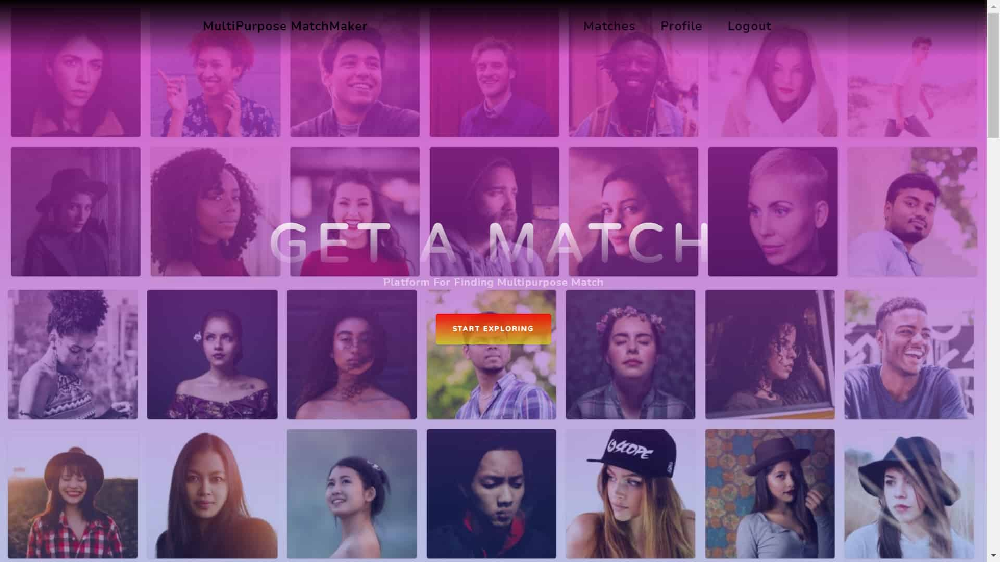Landing Page
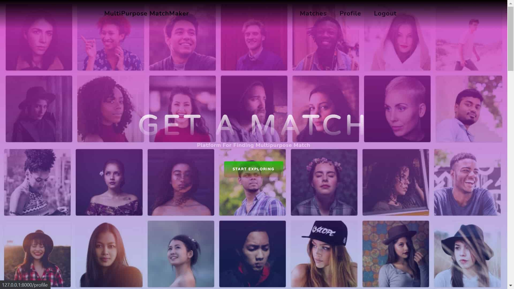Landing Page
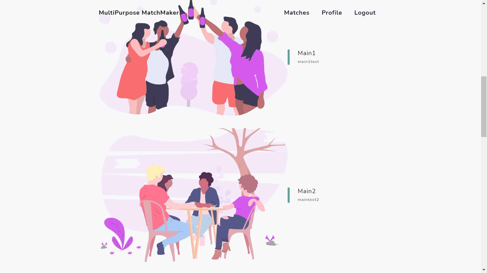Landing Page
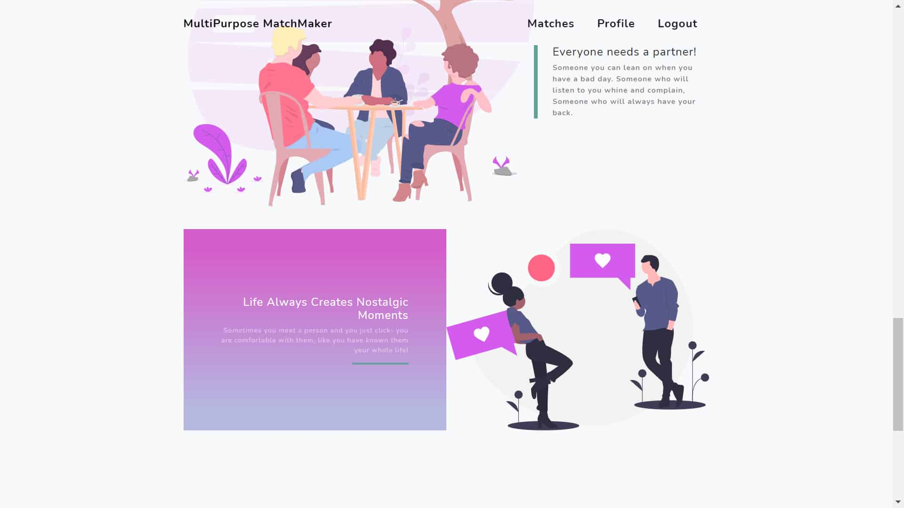Landing Page
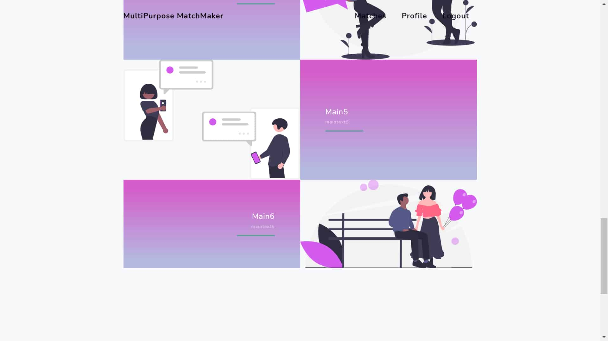Landing Page
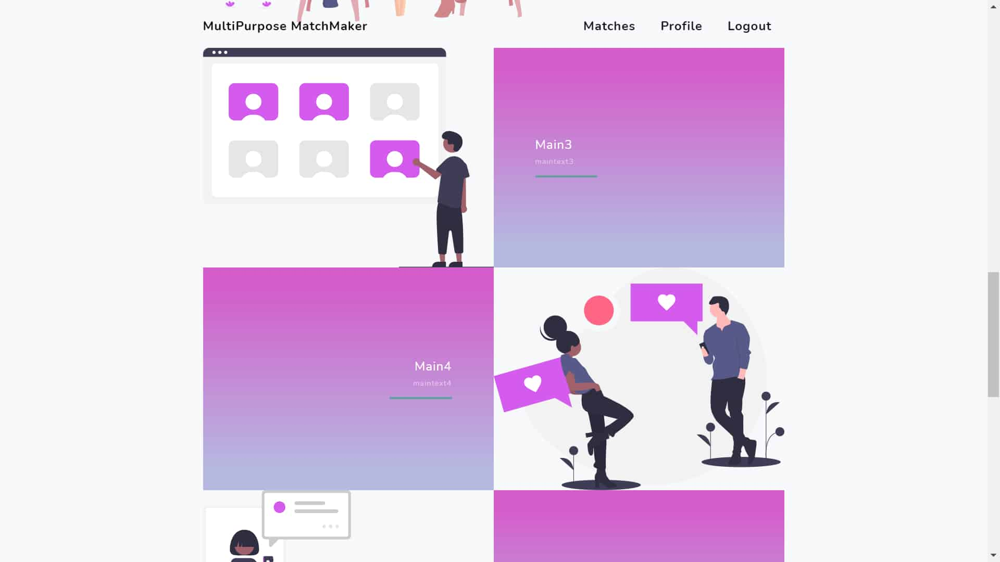Landing Page
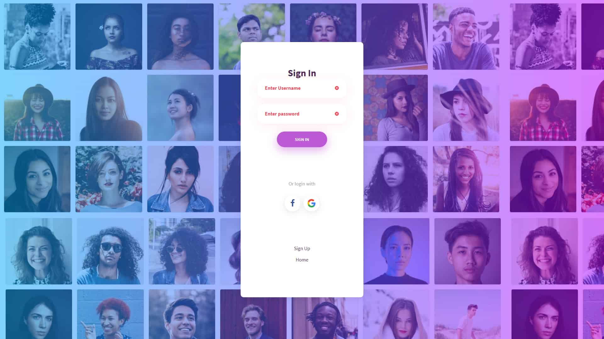SignIn
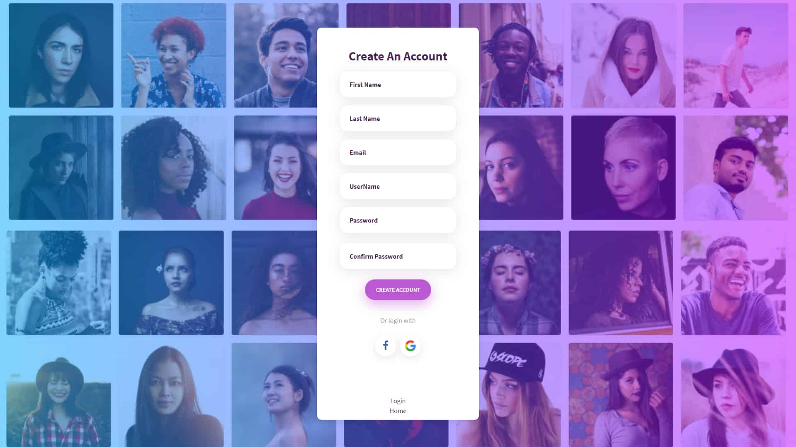SignUp
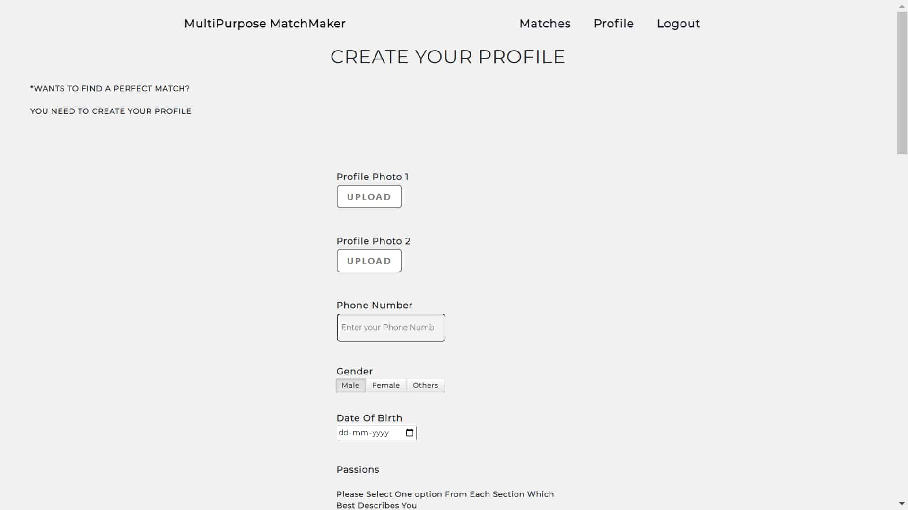Profile Page
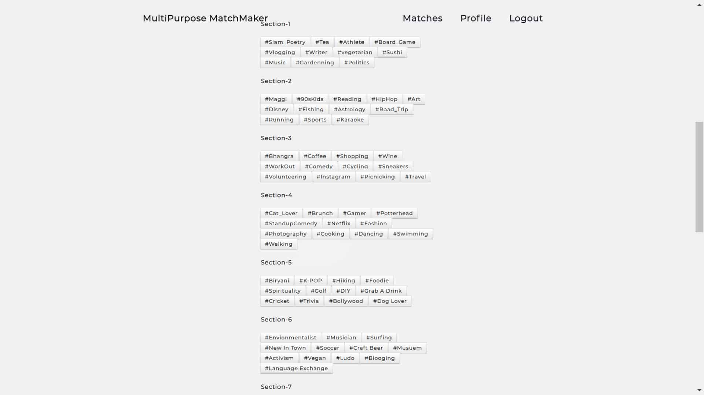Profile Page
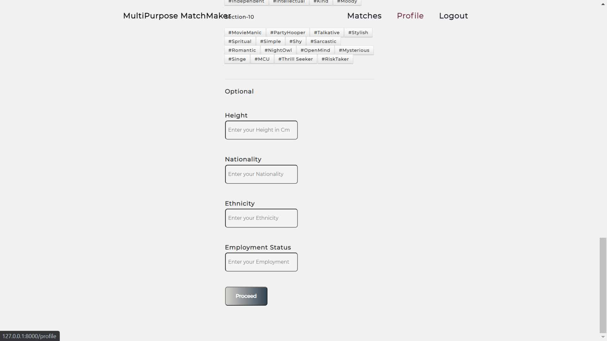Profile Page
Purpose Page1
Purpose Page2
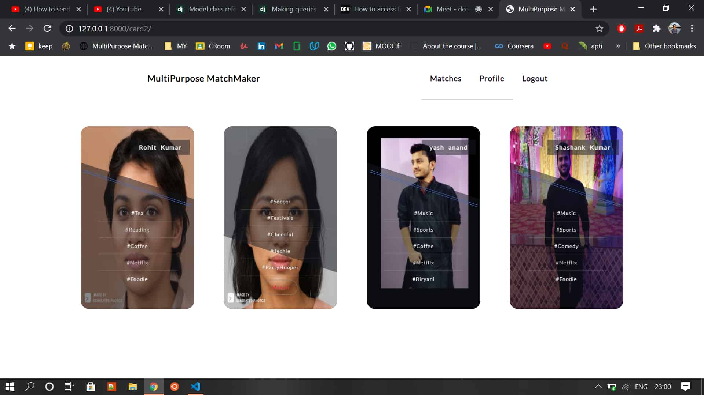Match For PurPose1
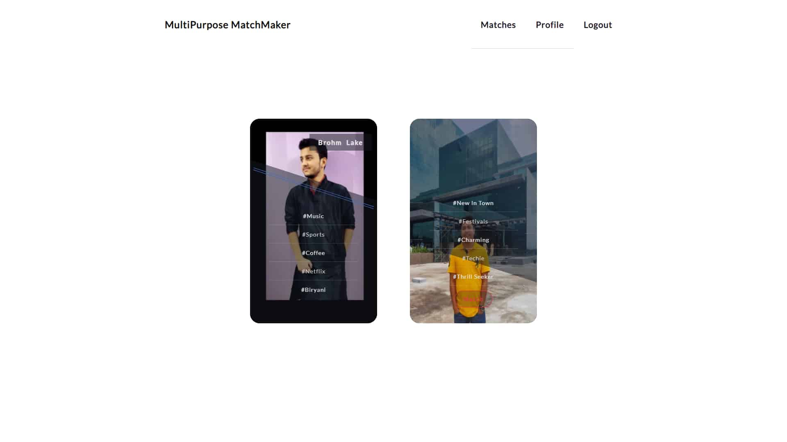Match For PurPose2

 
<h2>Author</h2>
<blockquote>
  Rohit Raj 
  Email: rohit3374@gmail.com
</blockquote>

    <h3>========Thank You !!!=========</h3>

